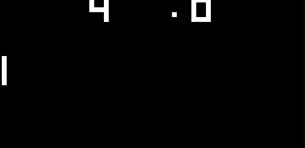

# CHIP-8 Emulator

Tetris                     |  Pong
:-------------------------:|:-------------------------:
 | 

CHIP-8 is an interpretted programming language developed by Joseph Weisbecker in the mid 70s and was initally used on the COSMAC VIP and Telmac 1800 8-bit microcomputers to make game programming easier. CHIP-8 programs are run using a CHIP-8 virtual machine.

## Instruction Set Table

There are 35 instructions in the Chip8 programming language. The opcodes will contain additional information necessary to execute the instruction. This information is as follows: X represents register VX, Y represents register VY, N represents a 4-bit immediate value, NN represents an 8-bit immediate value, NNN represents a 12-bit immediate value.

|Mnemonic|Opcode|Description|
|-------|------|-----------|
| CLS   | 00E0 | Clear Screen |
| RET   | 00EE | Return from Subroutine |
| OEXE  | 0NNN | Execute machine language Subroutine at NNN. Deprecated |
| JUMP  | 1NNN | Jump to Address NNN |
| EXE   | 2NNN | Execute Subroutine at NNN |
| SEI   | 3XNN | Skip next instruction if the value in register VX equals the immediate value NN |
| SNEI  | 4XNN | Skip next instruction if the value in register VX is not equal to the immediate value NN |
| SE    | 5XY0 | Skip next instruction if the value in register VX is equal to VY |
| STRI  | 6XNN | Store the immediate value NN in register VX |
| ADDI  | 7XNN | Add the immediate value NN to register VX |
| COPY  | 8XY0 | Copy the value of register VY into register VX |
| OR    | 8XY1 | OR the value of register VX with the value of register VY and store in register VX |
| AND   | 8XY2 | AND the value of register VX with the value of register VY and store in register VX |
| XOR   | 8XY3 | XOR the value of register VX with the value of register VY and store in register VX |
| ADD   | 8XY4 | Add the value of register VY to register VX. VF is set to 01 if a carry occurs, else 00 |
| SUB   | 8XY5 | Subtract the value of register VY from register VX and store the result in VX. VF is set to 00 when negative, else 01 |
| RSH   | 8XY6 | Shift register VY right one bit and store the value into VX. VF is set to the shifted out bit |
| SUBR  | 8XY7 | Subtract the value of register VX from register VY and store the result in VX. VF is set o 00 when negative, else 01 |
| LSH   | 8XYE | Shift register VY left one bit and store the value into VX. VF is set to the shifted out bit |
| SNE   | 9XY0 | Skip next instruction if the value in register VX is not equal to the value in register VY |
| STR   | ANNN | Store the memory address NNN in register I |
| BR    | BNNN | Jump to address NNN offset by the value in V0 |
| RND   | CXNN | Set register VX to a randomly generated number AND'd with immediate value NN |
| DRAW  | DXYN | Render the sprite at register I to the position (VX, VY) with N bytes of data |
| SP    | EX9E | Skip next instruction if the key corresponding to the value of the lower 4 bits in register VX is pressed |
| SNP   | EXA1 | Skip next instruction if the key corresponding to the value of the lower 4 bits in register VX is not pressed |
| STRD  | FX07 | Copy the value in register DT into register VX |
| WAIT  | FX0A | Wait for a keypress and store the key value into register VX |
| SETD  | FX15 | Set the delay timer to the value in register VX |
| SETS  | FX18 | Set the sound timer to the value in register VX |
| OFFS  | FX1E | Add the value in register VX to register I |
| NUM   | FX29 | Set the value in register I to the corresponding digit sprite of the value in register VX |
| BCD   | FX33 | Generate the binary coded decimal of the value in register VX starting at the address pointed to by register I |
| STRM  | FX55 | Store the values from registers V0 to VX into memory starting at the address stored in I |
| LDM   | FX65 | Load the values in memory starting at address I into registers V0 to VX |

## References

Helpful resources:
* https://github.com/airloaf/ChipM8-Core/wiki/
* http://devernay.free.fr/hacks/chip8/C8TECH10.HTM#00E0
* https://www.youtube.com/watch?v=rpLoS7B6T94
